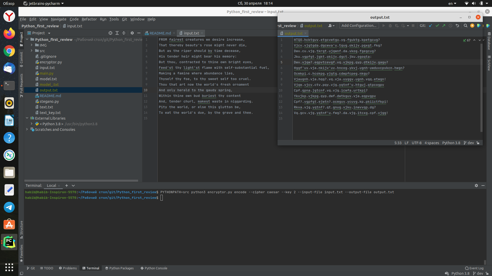
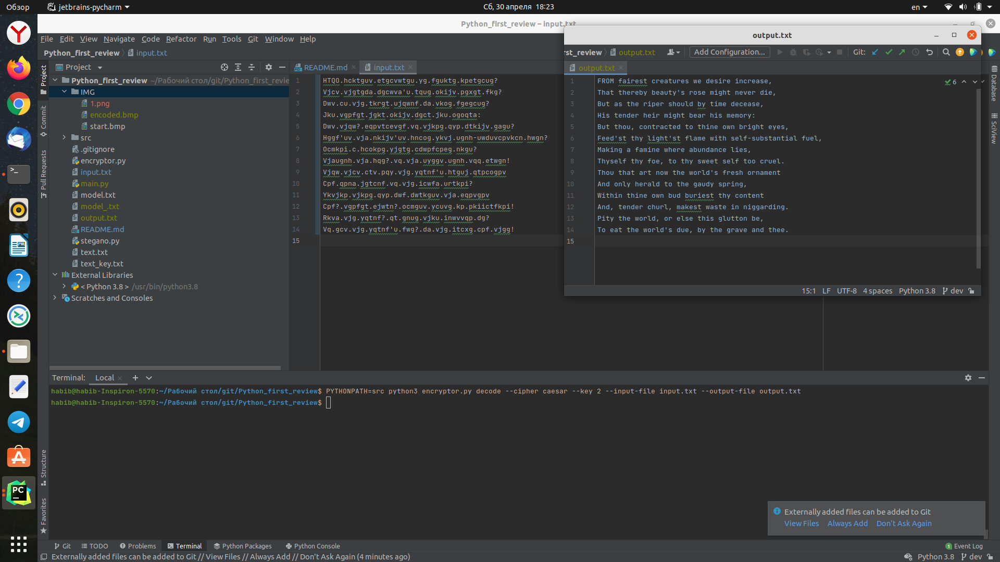
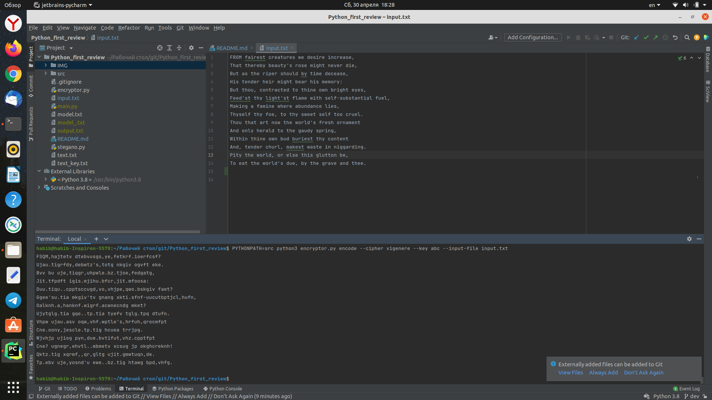
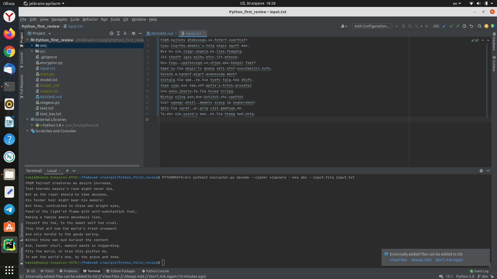
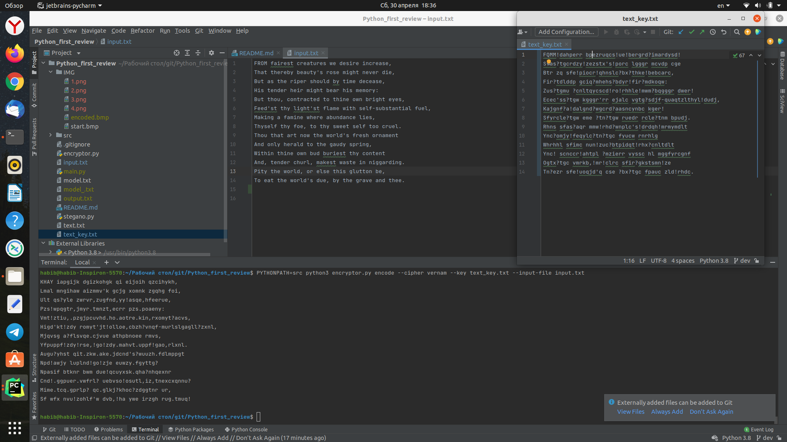
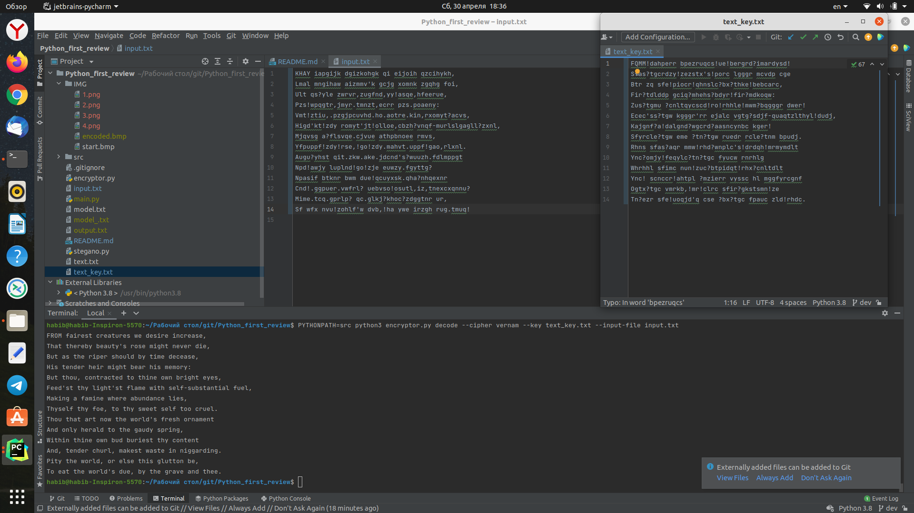
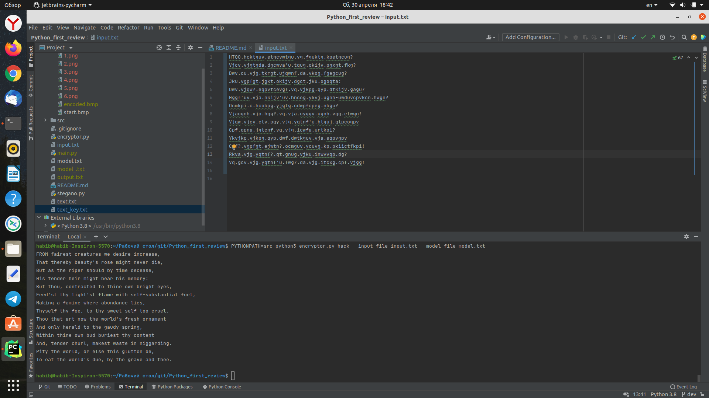
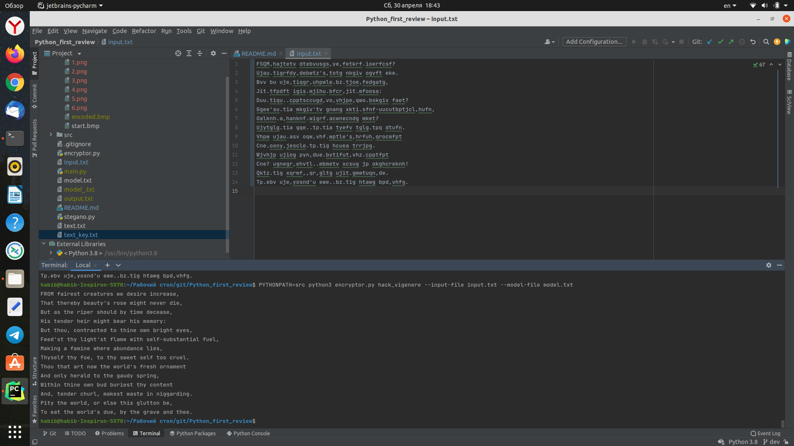
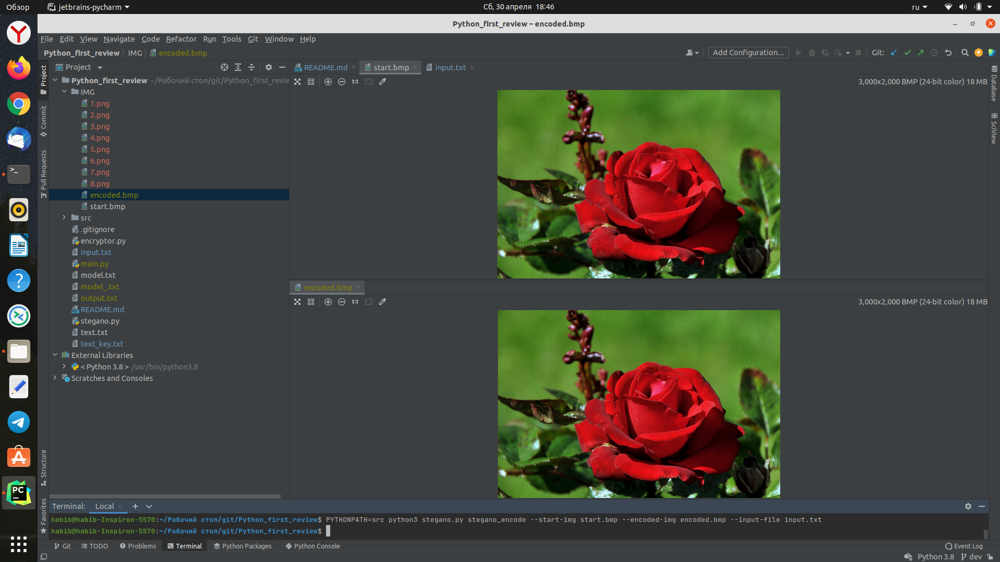
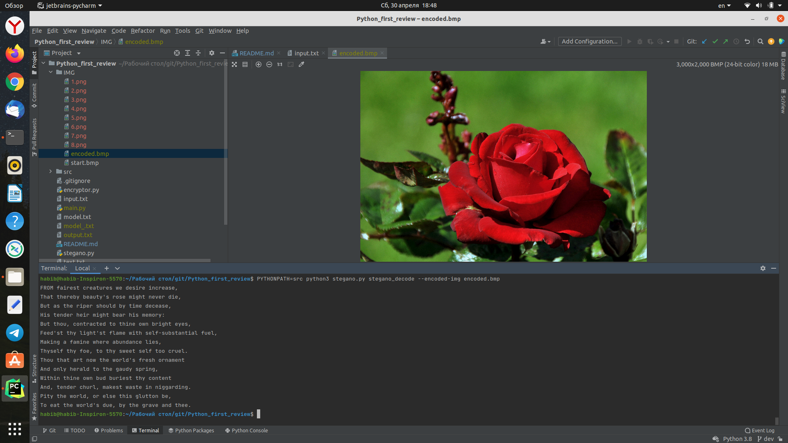

# Первое ревью

### Клонирование репозитория с помощью ssh
В терминале запускайте следующие команды
> git clone git@github.com:humooo/Python_first_review.git

можно заметить, что появилась папка Python_first_review, наберите эту команду
> cd Python_first_review

дальнейшие работы также делайте в том же терминале для каждого случая(ниже приведены примеры и скрины для них)

### Шифрование шифра Цезаря:
>  PYTHONPATH=src python3 encryptor.py encode --cipher caesar --key {number} [--input-file input.txt] [--output-file out.txt] \
> \
Зашифровать входное сообщение с помощью ключа

### Дешифрование шифра Цезаря:
>  PYTHONPATH=src python3 encryptor.py decode --cipher caesar --key {number} [--input-file input.txt] [--output-file out.txt] \
> \
Расшифровать входное сообщение, зная ключ, с которым оно было зашифровано

### Шифрование шифра Виженера:
>  PYTHONPATH=src python3 encryptor.py encode --cipher vigenere --key {word} [--input-file input.txt] [--output-file out.txt] \
> \
Зашифровать входное сообщение с помощью ключа

### Дешифрование шифра Виженера:
>  PYTHONPATH=src python3 encryptor.py decode --cipher vigenere --key {word} [--input-file input.txt] [--output-file out.txt] \
> \
Расшифровать входное сообщение, зная ключ, с которым оно было зашифровано

### Шифрование шифра Вернама:
>  PYTHONPATH=src python3 encryptor.py encode --cipher vernam --key {text_key.txt} [--input-file input.txt] [--output-file out.txt] \
> \
Зашифровать входное сообщение с помощью ключа

### Дешифрование шифра Вернама:
>  PYTHONPATH=src python3 encryptor.py decode --cipher vernam --key {text_key.txt} [--input-file input.txt] [--output-file out.txt] \
> \
Расшифровать входное сообщение, зная ключ, с которым оно было зашифровано

### Построить языковую модель для взлома:

> PYTHONPATH=src python3 encryptor.py train  --text-file text.txt --model-file model.txt \
> \
> Проанализировать большой текст(текст Шекспира) и построить языковую модель

### Взлом шифра Цезаря методами частотного анализа:

> PYTHONPATH=src python3 encryptor.py hack [--input-file input.txt] [--output-file output.txt] --model-file model.txt \
> \
> Рассшифровать текст

### Взлом шифра Виженера с помощью индексов совпадений:
> PYTHONPATH=src python3 encryptor.py hack_vigenere [--input-file input.txt] [--output-file output.txt] --model-file model.txt \
> \
> Рассшифровать текст

### Стеганография:
> PYTHONPATH=src python3 stegano.py stegano_encode  --start-img {start.png|start.bmp} --encoded-img {encoded.png|encoded.bmp} [--input-file input.txt] \
> \
Шифрование

Можно заметить, что фотографии практически ничем не отличаются 

> PYTHONPATH=src python3 stegano.py stegano_encode --encoded-img {encoded.png|encoded.bmp} [--output-file output.txt] \
> \
Расшифрование
